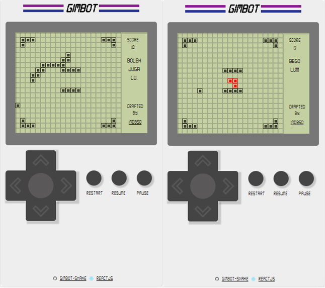

**DEMO LINK:** [https://imdbsd.github.io/gimbot-snake/](https://imdbsd.github.io/gimbot-snake/)

# GIMBOT SNAKE

Rebuilded version of old school snake game in gameboy (or gimbot).

Created using [react.js](https://reactjs.org/ "react.js")  , bootstrapped with [Create React App](https://github.com/facebookincubator/create-react-app) and developed to support [Progressive Web App](https://developers.google.com/web/progressive-web-apps/), so you can install it in your mobile device.

Design inspired by [baumannzone/gameboy-css](https://github.com/baumannzone/gameboy-css), visit his awesome design!

## KEYBOARD CONTROLLER

Key to use when you are playing in computer

| Action        |Key
|:-------------|:-------------
| Move-up        | `arrow-up`
| Move-Down      | `arrow-down`
| Move-Left      | `arrow-left`
| Move-Right     | `arrow-right`
| Restart        | `r`
| Pause          | `spacebar`
| Resume         | `g`

P.S. Feel free to report wen finding some bug, because not tested in all of browser and mobile phone.